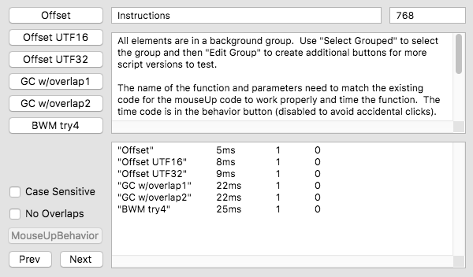
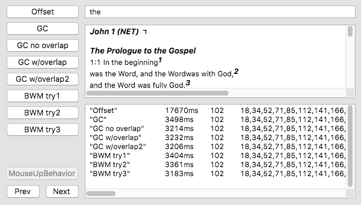

# allOffsets

### Instructions



All elements are in a background group.  Use "Select Grouped" to select the group and then "Edit Group" mode to make it easy to duplicate buttons for more script versions to test that will show up on all cards.

The name of the function and parameters need to match the existing code for the mouseUp code to work properly and time the function.  The time code is in the behavior button (disabled to avoid accidental clicks).

```
function allOffsets pDelim, pString, pCaseSensitive, pNoOverlap
```

Add new cards to the stack to test different combinations of settings and strings.  Case sensitive/No overlaps settings are unique per card.

The Offset button will clear the results field at the bottom of the card before adding the result.  Each button will add a line with the actual result and the time to do 1000 iterations.  The columns are the button name, time (ms), result count, list of matches.


### Earlier version layout


